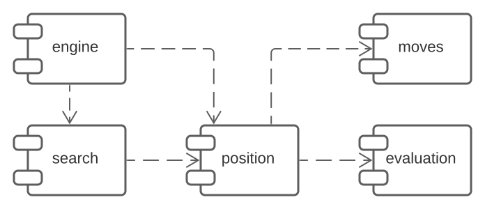

 
 

## Overview

Camel is a chess engine written from scratch in Rust. It aims to achieve a high level of play, while also being easy to understand and modify. It is primarily meant to be used within a GUI compatible with the [UCI protocol](https://backscattering.de/chess/uci/), but may also be operated in a CLI.

## Compilation

Make sure you have an updated [Rust](https://www.rust-lang.org/learn/get-started) environment on your machine. For best results, compile with LLVM optimizations enabled:

<pre>
  $ cargo build --release
</pre>

## Testing

You can probe the integrity of the engine by running the test suite, which includes [perft](https://www.chessprogramming.org/Perft_Results) and other unit tests:

<pre>
  $ cargo test
</pre>

Upon development, to be able to claim a statistically significant improvement over the last version, it is recommended to set up a tournament between the two versions, using a utility such as [fast-chess](https://github.com/Disservin/fast-chess) or [cutechess-cli](https://github.com/cutechess/cutechess).

It is also possible and fun to deploy the engine to [lichess](https://lichess.org/), through the [lichess-bot bridge](https://github.com/lichess-bot-devs/lichess-bot). Please note, however, that the obtained [Glicko](https://lichess.org/page/rating-systems) rating is not directly comparable to [FIDE](https://en.wikipedia.org/wiki/FIDE)'s due to different player pools.

## Usage

You can use a GUI such as [Scid](https://flathub.org/apps/details/io.github.benini.scid) to be able to play against the engine or analyze a game. Alternatively, you can explore the engine through the interactive CLI, which builds on top of the UCI protocol, allowing you to visualize the board, make a move of your own, query legal moves and ask the engine to move.

<pre>
  $ <b>position fen r1q1k1r1/pp1np1b1/5npp/1Q1NN1p1/3P4/4B2P/PPP2PP1/4RRK1 w q - 3 16</b>
  $ <b>display</b>
  ♜ - ♛ - ♚ - ♜ - 
  ♟ ♟ - ♞ ♟ - ♝ - 
  - - - - - ♞ ♟ ♟ 
  - ♕ - ♘ ♘ - ♟ - 
  - - - ♙ - - - - 
  - - - - ♗ - - ♙ 
  ♙ ♙ ♙ - - ♙ ♙ - 
  - - - - ♖ ♖ ♔ - 
  $ <b>list</b>
  e1e2 e1d1 e1c1 e1b1 e1a1 g1h1 g1h2 a2a3 a2a4 b2b3 b2b4 c2c3 c2c4 f2f3 f2f4 g2g3 g2g4 e3f4
  e3g5 e3d2 e3c1 h3h4 b5b6 b5b7 b5b4 b5b3 b5a5 b5c5 b5a6 b5c6 b5d7 b5a4 b5c4 b5d3 b5e2 d5c7
  d5e7 d5c3 d5b6 d5b4 d5f6 d5f4 e5d7 e5f7 e5d3 e5f3 e5c6 e5c4 e5g6 e5g4
  $ <b>go depth 6</b>
  info depth 1 score cp 324 time 4 nodes 598 nps 137134 pv e5g6
  info depth 2 score cp 324 time 13 nodes 598 nps 42912 pv e5g6 e7e6
  info depth 3 score cp 309 time 57 nodes 1715 nps 29579 pv e5g6 e7e6 g6e7
  info depth 4 score cp 309 time 226 nodes 4812 nps 21237 pv e5g6 e7e6 g6e7 a7a6
  info depth 5 score cp 307 time 1166 nodes 19830 nps 16992 pv e5g6 e7e6 g6e7 a7a6 b5d3
  info depth 6 score cp 312 time 3716 nodes 112194 nps 30189 pv e3g5 h6g5 e5d7 f6d7 d5e7 g7d4
  bestmove e3g5
  $ <b>domove e3g5</b>
  $ <b>display</b>
  ♜ - ♛ - ♚ - ♜ - 
  ♟ ♟ - ♞ ♟ - ♝ - 
  - - - - - ♞ ♟ ♟ 
  - ♕ - ♘ ♘ - ♗ - 
  - - - ♙ - - - - 
  - - - - - - - ♙ 
  ♙ ♙ ♙ - - ♙ ♙ - 
  - - - - ♖ ♖ ♔ - 
</pre>

Type `help` to see the available commands.

## Design

Camel uses domain-specific techniques to achieve higher performance. The board is represented using [bitboards](https://www.chessprogramming.org/Bitboards) and the move generation is aided by [magics](https://www.chessprogramming.org/Magic_Bitboards). The search is based on [alpha-beta pruning](https://www.chessprogramming.org/Alpha-Beta), enhanced with a [transposition table](https://www.chessprogramming.org/Transposition_Table) and [extension](https://www.chessprogramming.org/Extensions) and [reduction](https://www.chessprogramming.org/Reductions) schemas. [Iterative deepening](https://www.chessprogramming.org/Iterative_Deepening) enables the time management framework.

Dive into the [chess programming wiki](https://www.chessprogramming.org/Main_Page) to learn more about these techniques.

## What can I do with it?

Camel is licensed under the [GNU General Public License v3.0](./LICENSE.md). You can use it for any purpose, including commercial use, provided you always include the license and the source code. Feel free to fork the repository and propose your own changes.

## Credits

- [@biromiro](https://github.com/biromiro): for designing the cute camel logo.
- [Chess Programming Wiki](https://www.chessprogramming.org/Main_Page): for the great explanations on the state of the art.
- [Lichess](https://lichess.org/): for the friendly bot API.
- [Fast-Chess](https://github.com/Disservin/fast-chess): for a lightweight, dependency-free way to set up engine matches.

## Why Camel?

Camel likes to play active chess. It does grunt sometimes when it loses, though.
